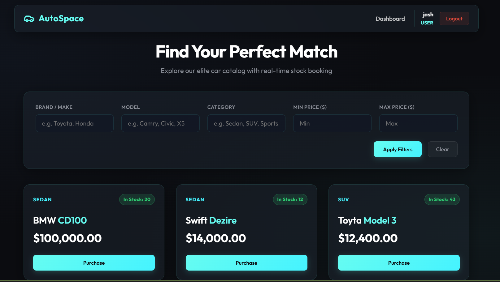
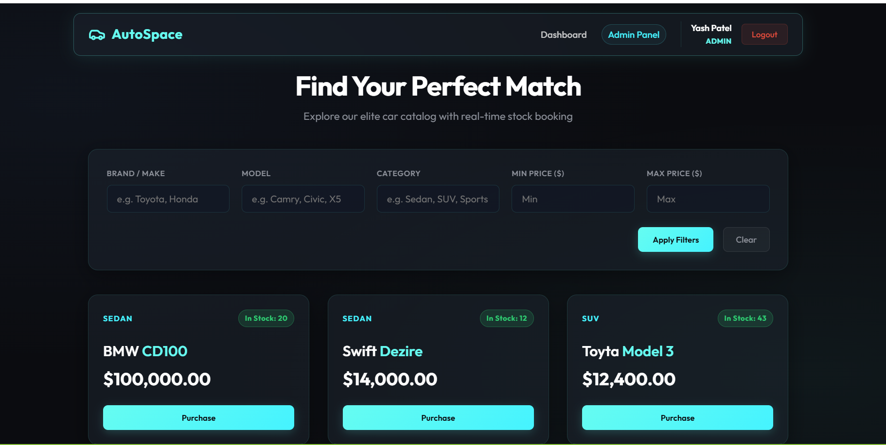
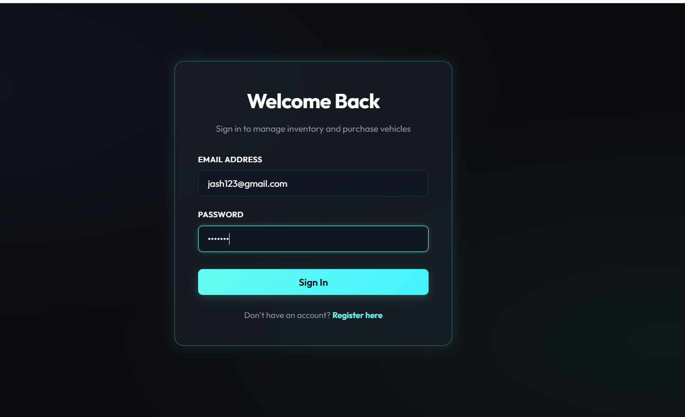
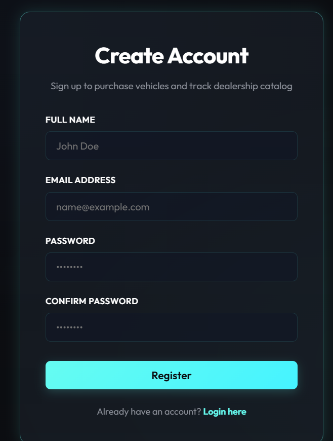
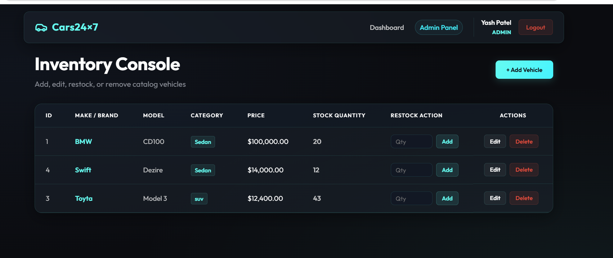
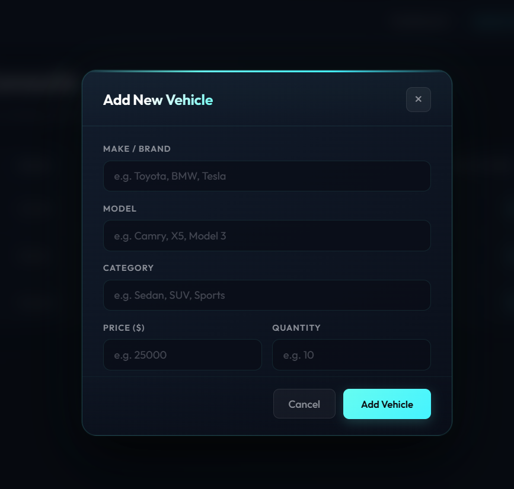

# 🚗 Car Dealership Inventory Management System

A full-stack, production-ready **Car Dealership Inventory System** built with **Java 21 + Spring Boot 3**, **React (Vite)**, and **PostgreSQL**, developed strictly following **Test-Driven Development (TDD)** principles.

---

## 🛠️ Technology Stack

| Layer | Technology |
|---|---|
| **Backend Framework** | Java 21 + Spring Boot 3.3.2 |
| **Database** | PostgreSQL 16+ (production) |
| **Security / Auth** | Spring Security + JWT (JSON Web Token) |
| **Database Access** | Spring Data JPA + Hibernate 6 |
| **Testing** | JUnit 5 + Mockito + MockMvc + H2 (in-memory test DB) |
| **Frontend** | React 18 + Vite |
| **Styling** | Vanilla CSS (Glassmorphic dark theme) |
| **HTTP Client** | Axios with JWT interceptors |
| **Performance** | HikariCP Connection Pool + Pessimistic Row Locking |

---

## 🏗️ Architecture & Scalability Highlights

### 1. Concurrency Control (Pessimistic Locking)
During high concurrent user volumes (e.g., multiple users checking out the same vehicle at once), standard database transactions can suffer from **Lost Update** race conditions.

We implemented row-level locking (`SELECT ... FOR UPDATE`) in `VehicleRepository` using JPA `@Lock(LockModeType.PESSIMISTIC_WRITE)`. This locks the vehicle row until the transaction commits, ensuring stock decrements are strictly serialised and preventing over-selling.

### 2. High-Performance Connection Pooling (HikariCP)
Configured with HikariCP settings in `application.properties`:
* **Max Pool Size:** 20 concurrent connections
* **Idle Timeout:** 5 minutes
* **Leak Detection Threshold:** 15 seconds

### 3. Role-Based Access Control (RBAC)
Two roles are supported: `USER` and `ADMIN`.

| Operation | USER | ADMIN |
|---|---|---|
| Register / Login | ✅ | ✅ |
| Browse vehicles (GET) | ✅ Guest & Auth | ✅ |
| Search vehicles | ✅ Guest & Auth | ✅ |
| Add vehicle (POST) | ✅ Auth required | ✅ |
| Update vehicle (PUT) | ✅ Auth required | ✅ |
| Delete vehicle (DELETE) | ❌ 403 Forbidden | ✅ |
| Purchase vehicle | ✅ Auth required | ✅ |
| Restock vehicle | ❌ 403 Forbidden | ✅ |

### 4. OWASP Security Compliance
* Frame Options: `DENY`
* Content Security Policy (CSP): `default-src 'self'`

---

## 📋 REST API Specification

### 🔐 Authentication (`/api/auth`)
| Method | Endpoint | Access | Description |
|---|---|---|---|
| POST | `/api/auth/register` | Public | Register new user — returns JWT |
| POST | `/api/auth/login` | Public | Login — returns JWT |

**Register Request Body:**
```json
{ "name": "John Doe", "email": "john@example.com", "password": "secret123" }
```
**Login Request Body:**
```json
{ "email": "john@example.com", "password": "secret123" }
```
**Auth Response:**
```json
{ "token": "eyJ...", "name": "John Doe", "email": "john@example.com", "role": "USER" }
```

### 🚗 Vehicle CRUD (`/api/vehicles`)
| Method | Endpoint | Access | Description |
|---|---|---|---|
| GET | `/api/vehicles` | Public | List all vehicles |
| GET | `/api/vehicles/{id}` | Public | Get vehicle by ID |
| GET | `/api/vehicles/search` | Public | Search vehicles (see params below) |
| POST | `/api/vehicles` | Authenticated | Add new vehicle |
| PUT | `/api/vehicles/{id}` | Authenticated | Update vehicle |
| DELETE | `/api/vehicles/{id}` | **ADMIN only** | Delete vehicle |

**Vehicle fields:** `id`, `make`, `model`, `category`, `price`, `quantity`

**Vehicle Request Body:**
```json
{ "make": "Toyota", "model": "Camry", "category": "Sedan", "price": 25000.00, "quantity": 10 }
```

### 🔍 Vehicle Search Parameters (`GET /api/vehicles/search`)
| Parameter | Type | Description |
|---|---|---|
| `make` | string (optional) | Filter by brand/make (partial match) |
| `model` | string (optional) | Filter by model name (partial match) |
| `category` | string (optional) | Filter by category (exact match) |
| `minPrice` | decimal (optional) | Minimum price filter |
| `maxPrice` | decimal (optional) | Maximum price filter |

**Example:** `GET /api/vehicles/search?make=Toyota&category=Sedan&minPrice=20000&maxPrice=50000`

### 📦 Inventory Operations
| Method | Endpoint | Access | Description |
|---|---|---|---|
| POST | `/api/vehicles/{id}/purchase` | Authenticated | Decrements stock by 1 |
| POST | `/api/vehicles/{id}/restock` | **ADMIN only** | Increases stock |

**Restock Request Body:** `{ "amount": 10 }`

---

## 🚀 Local Installation & Running Guide

### Prerequisites
- Java 21+
- Maven (or use included `mvnw`)
- PostgreSQL 16+
- Node.js 18+

### 1. Database Setup
Ensure PostgreSQL is running and create the database:
```sql
CREATE DATABASE "TDD-Cars";
```

Verify credentials in `Backend/src/main/resources/application.properties`:
```properties
spring.datasource.url=jdbc:postgresql://localhost:5432/TDD-Cars
spring.datasource.username=postgres
spring.datasource.password=yash@2006
```

### 2. Start the Backend
```bash
cd Backend
.\mvnw.cmd spring-boot:run
```
The API server runs on **`http://localhost:8080`**.

### 3. Start the Frontend
Open a **second terminal**:
```bash
cd frontend
npm install
npm run dev
```
The SPA runs on **`http://localhost:5173`** and auto-proxies all `/api` calls to `localhost:5000`.

> ⚠️ **Both servers must be running simultaneously** for the full application to work.

### 4. Create an Admin User
All registered users start as `USER`. To promote to `ADMIN`, run this SQL in PostgreSQL:
```sql
UPDATE users SET role = 'ADMIN' WHERE email = 'your@email.com';
```
After promotion, log out and back in. The Navbar will show the **Admin Panel** link.

### 5. Run All Automated Tests
H2 in-memory database is used exclusively during testing (no PostgreSQL required):
```bash
cd Backend
.\mvnw.cmd test
```

---

## 🧪 Test Report

### Test Suite Results

| Test Class | Type | Tests | Status |
|---|---|---|---|
| `AuthServiceTest` | Unit (Mockito) | 4 | ✅ PASS |
| `VehicleServiceTest` | Unit (Mockito) | 7 | ✅ PASS |
| `InventoryServiceTest` | Unit (Mockito) | 5 | ✅ PASS |
| `JwtServiceTest` | Security Unit | 4 | ✅ PASS |
| `AuthControllerIntegrationTest` | Integration (MockMvc) | 5 | ✅ PASS |
| `VehicleControllerIntegrationTest` | Integration (MockMvc) | 9 | ✅ PASS |
| `VehicleSearchIntegrationTest` | Integration (MockMvc) | 4 | ✅ PASS |
| `InventoryControllerIntegrationTest` | Integration (MockMvc) | 5 | ✅ PASS |
| `ConcurrentPurchaseIntegrationTest` | Concurrency Load | 1 | ✅ PASS |
| `BackendApplicationTests` | Context Load | 1 | ✅ PASS |
| **TOTAL** | | **46** | **✅ BUILD SUCCESS** |

### Key Test Scenarios Covered
- ✅ Password BCrypt encoding — plain text never stored
- ✅ Duplicate email registration returns `409 Conflict`
- ✅ JWT expired token rejection
- ✅ Unauthenticated requests to protected endpoints → `401 Unauthorized`
- ✅ Regular user DELETE / restock → `403 Forbidden`
- ✅ Admin DELETE → `204 No Content`
- ✅ Guest `GET /api/vehicles` → `200 OK` (public browsing)
- ✅ Search by make, model, category, price range
- ✅ Out-of-stock purchase → `400 Bad Request`
- ✅ Concurrent purchases — 10 threads, pessimistic lock prevents over-selling

```
[INFO] Tests run: 46, Failures: 0, Errors: 0, Skipped: 0
[INFO] BUILD SUCCESS
```

---

## 📸 Application Screenshots

### 1. User Dashboard & Catalog Browsing


### 2. Live Filters & Search by Category/Make/Model


### 3. Glassmorphic User Login & Registration
| Sign In | Sign Up |
|---|---|
|  |  |

### 4. Admin Management Console


### 5. Add / Edit Vehicle Modal Form


---

## 🤖 My AI Usage

### 🛠️ AI Tools Used
* **Antigravity (built by Google DeepMind)**: Used throughout the entire project lifecycle for TDD test generation, architectural design, debugging, and code review.

### 🧩 How AI Was Leveraged

1. **API & Package Design**: Used AI to design RESTful endpoint layouts, DTO requirements, and Spring Boot packaging patterns following standard layered architecture.

2. **Test-Driven Development Loop**:
   - Wrote failing tests (RED) first for `AuthService`, `VehicleService`, `InventoryService`
   - AI generated integration test structure for MockMvc controller tests
   - Refactored services to make tests green, then cleaned up

3. **Concurrency Bug Analysis**:
   - `ConcurrentPurchaseIntegrationTest` initially failed (10 threads all purchased from 3-item stock)
   - AI identified the root cause: default `READ COMMITTED` isolation allows concurrent threads to read the same stock value simultaneously
   - Fix: Added `@Lock(LockModeType.PESSIMISTIC_WRITE)` via `findByIdForUpdate()` in `VehicleRepository`

4. **H2 Dialect Fix**:
   - PostgreSQL-specific `RETURNING ID` syntax caused `ConcurrentPurchaseIntegrationTest` SQL errors on H2
   - AI identified the fix: override Hibernate dialect in `application-test.properties` to `H2Dialect`

5. **Frontend Architecture**: React context pattern for auth state (`AuthContext`), custom Axios interceptors for automatic JWT injection, glassmorphic CSS design system, and `ProtectedRoute` guard component.

6. **Security Configuration**: Configuring Spring Security with stateless JWT sessions, custom 401/403 JSON error handlers, CORS for `localhost:5173`, and OWASP security headers.

### 💡 Workflow Reflections
* **Velocity**: The RED-GREEN-REFACTOR loop with AI-assisted test generation meant edge cases (out-of-stock, 401, 403, duplicate email) were identified before code was written — drastically reducing debugging time.
* **Architectural clarity**: AI helped translate vague requirements ("protect admin endpoints") into concrete Spring Security `@PreAuthorize` rules and SecurityConfig matchers.
* **Responsible use**: All generated code was reviewed, understood, and validated by running actual tests. The AI augmented productivity but final decisions were developer-driven.
